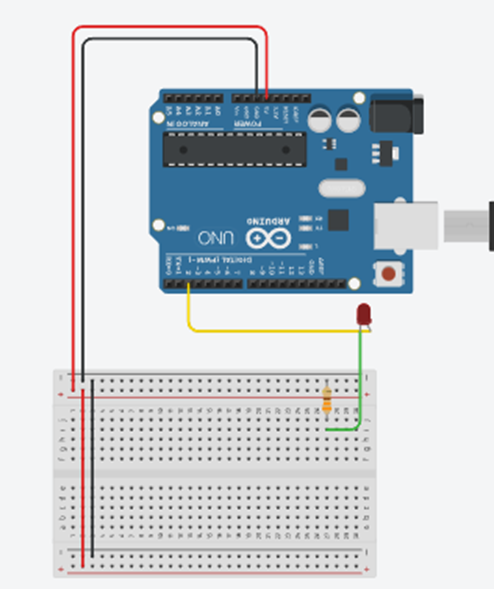
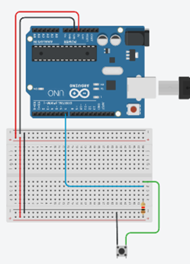
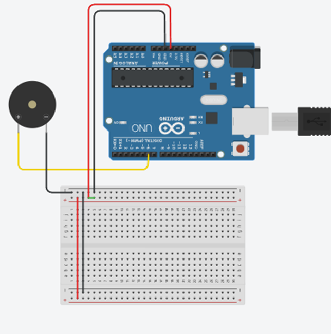
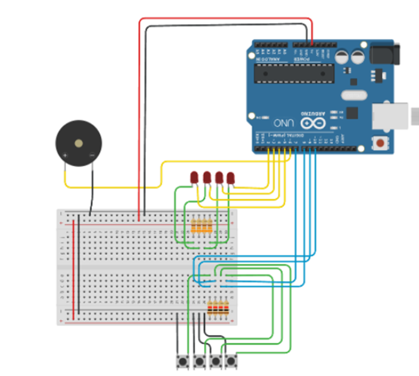
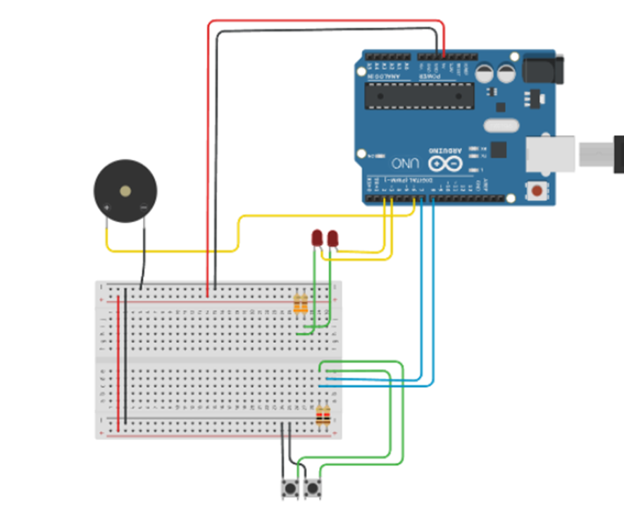
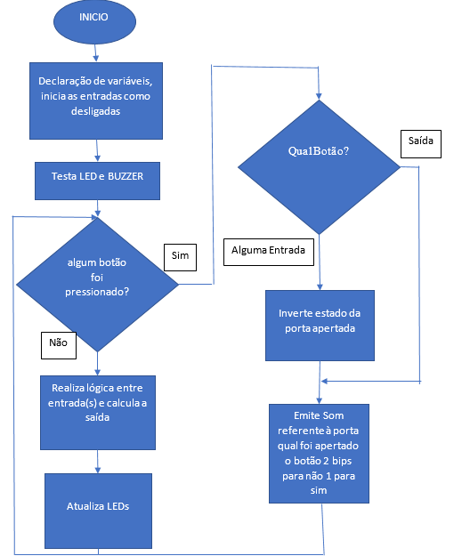

# Manual de Montagem do Kit de Portas Lógicas
# Introdução

Este manual foi desenvolvido para orientar a montagem e manutenção de um material didático focado em portas lógicas. Aqui, você encontrará instruções detalhadas para construir três modelos de portas lógicas: "E", "OU" e "NÃO". Estes modelos são ideais para criar seu próprio material didático dentro da sua instituição, proporcionando uma abordagem prática e acessível ao ensino de conceitos fundamentais de lógica.

# Sobre Acessibilidade
A acessibilidade é um aspecto central deste projeto. O uso de som, luz, superfícies salientes, braille e peças móveis permite que alunos com diferentes necessidades especiais compreendam os conceitos de portas lógicas de maneira mais intuitiva. Esses recursos acessíveis são integrados ao design das portas lógicas para garantir que o entendimento não dependa exclusivamente de um único sentido, mas que possa ser alcançado por meio de múltiplas vias sensoriais.
# Portas Lógicas
As portas lógicas são estruturas fundamentais no campo da computação e da eletrônica, atuando como blocos construtivos básicos para o processamento de informações. Cada porta lógica executa uma operação específica sobre os sinais de entrada, produzindo um resultado de acordo com as regras da lógica booleana.
•	Porta Lógica "E": Produz uma saída verdadeira apenas quando todas as entradas são verdadeiras. É frequentemente utilizada em circuitos que necessitam de condições simultâneas para operar.
•	Porta Lógica "OU": Gera uma saída verdadeira se pelo menos uma das entradas for verdadeira. Ideal para situações onde uma ou mais condições podem ser suficientes para acionar um processo.
•	Porta Lógica "NÃO": Inverte o sinal de entrada, transformando uma entrada verdadeira em falsa e vice-versa. É uma das portas mais simples, mas extremamente útil em diversas aplicações.
Produto Final
Figura 1: Kit E

# Funcionamento
As portas lógicas desenvolvidas neste kit permitem que o usuário interaja com as entradas e saídas de forma intuitiva. Para cada porta lógica, o usuário pode selecionar o estado de cada entrada (ativo ou inativo) através de um botão dedicado. Cada vez que o botão é pressionado, o estado da porta é invertido automaticamente, e o kit emite um som correspondente ao novo estado da porta de entrada, facilitando a compreensão auditiva do funcionamento lógico.
Além disso, há um botão específico para verificar o estado da porta de saída. Ao pressionar este botão, o usuário pode ouvir o som que representa o estado atual da saída, permitindo uma verificação rápida e acessível das operações lógicas realizadas.
Esse design inclusivo, com feedback sonoro, garante que tanto os alunos comuns quanto aqueles com deficiências possam interagir de maneira eficaz com as portas lógicas, entendendo seus conceitos por meio de múltiplos sentidos.

# Kit Arduino 
O Arduino é uma plataforma de prototipagem eletrônica que combina uma placa de circuito integrado com um microcontrolador e um ambiente de desenvolvimento integrado (IDE). É usado para criar projetos de hardware interativos, permitindo a programação e controle de dispositivos eletrônicos de maneira simples e acessível.
Serventia do Arduino para o Projeto
No projeto de controle de portas lógicas E e OU, o Arduino é essencial para:
1.	Controle dos LEDs e Botões: O Arduino lê os estados dos botões e controla os LEDs com base na lógica programada.
2.	Simulação de Portas Lógicas: Através da programação, o Arduino realiza operações lógicas E e OU, ajustando a saída dos LEDs conforme as entradas dos botões.
3.	Facilidade de Programação e Prototipagem: Permite a rápida implementação e teste do circuito, ajustando a lógica sem a necessidade de reconfigurar hardware.
Assim, o Arduino serve como o cérebro do projeto, gerenciando e processando as entradas e saídas para simular e demonstrar conceitos de portas lógicas.
O KIT Arduino do Senac já possui alguns compontes básicos como botões, leds, jumpers entre outros componentes essenciais para o funcionamento básico.
# Componentes necessário para montagem das portas lógicas:
| Componente              | PORTA E | PORTA OU | PORTA NÃO | Total |
|-------------------------|---------|----------|-----------|-------|
| Arduino UNO             | 1       | 1        | 1         | 3     |
| LED                     | 4       | 4        | 2         | 10    |
| PUSH BUTTON             | 4       | 4        | 2         | 10    |
| Resistor 330Ohm         | 4       | 4        | 2         | 10    |
| Resistor 1kOhm          | 4       | 4        | 2         | 10    |
| Buzzer                  | 1       | 1        | 1         | 3     |
| Jumper Macho/macho      | 18      | 18       | 8         | 44    |
| Jumper Macho fêmea      | 16      | 16       | 4         | 36    |

# 1. Ligando e Desligando um LED com Arduino
O Arduino pode controlar um LED enviando sinais de alta (HIGH) ou baixa (LOW) tensão através de um de seus pinos digitais. Quando o pino digital está configurado como saída e definido como HIGH, ele fornece uma tensão de aproximadamente 5V. Quando definido como LOW, a tensão cai para 0V. Essa mudança de tensão é o que liga ou desliga o LED.

# Por Que Usar um Resistor?
O resistor é um componente fundamental neste circuito porque ele limita a quantidade de corrente que passa pelo LED. Sem o resistor, o LED receberia mais corrente do que ele pode suportar, o que poderia danificá-lo ou até queimá-lo.
O resistor ajuda a proteger o LED e o próprio Arduino, garantindo que a corrente permaneça em níveis seguros. A resistência necessária depende da tensão do Arduino (geralmente 5V) e das características do LED, como sua queda de tensão (tipicamente entre 1,8V e 3,3V) e a corrente ideal (geralmente 20mA).
# Ligando um botão no Arduino:
Para ligar um botão ao Arduino e garantir que ele funcione corretamente, precisamos usar uma técnica chamada pull-up
# O Que é um Resistor Pull-up?
Um resistor pull-up é usado para garantir que o pino de entrada do Arduino leia um estado HIGH (1) estável quando o botão não está pressionado. Sem esse resistor, o pino de entrada pode ficar "flutuando", captando ruídos elétricos e gerando leituras instáveis.

•	Quando o botão NÃO está pressionado: O pino de entrada está conectado ao 5V através do resistor pull-up, garantindo que o Arduino leia um estado HIGH (1).
•	Quando o botão ESTÁ pressionado: O botão cria uma conexão direta entre o pino e o GND, fazendo com que o Arduino leia um estado LOW (0).

# Emitindo Som:
# O Que é um Buzzer?
Um buzzer é um dispositivo que produz um som quando uma corrente elétrica passa por ele. Existem dois tipos principais de buzzers:
•	Buzzer Ativo: Já contém um circuito interno que gera o som. Você só precisa fornecer uma tensão.
•	Buzzer Passivo: Não tem um circuito interno e precisa de uma frequência específica para gerar o som. Você precisa gerar um sinal de onda quadrada com o Arduino para fazê-lo funcionar.
Aqui está o circuito de ligação para tanto o buzzer ativo e passivo, utilizando o Arduino:

# Circuito para porta lógica E e OU:
Para essas duas portas o circuito será o mesmo, a diferença é na linguagem da programação que calculará se a saída está ativa de acordo com a lógica E ou OU. Serão 3 entradas e 1 saída para cada porta, para expressar os estados de acordo com o explicado anteriormente. O circuito final para o controle da porta lógica é:

# Agora o circuito para porta NÃO:

# Código fonte

